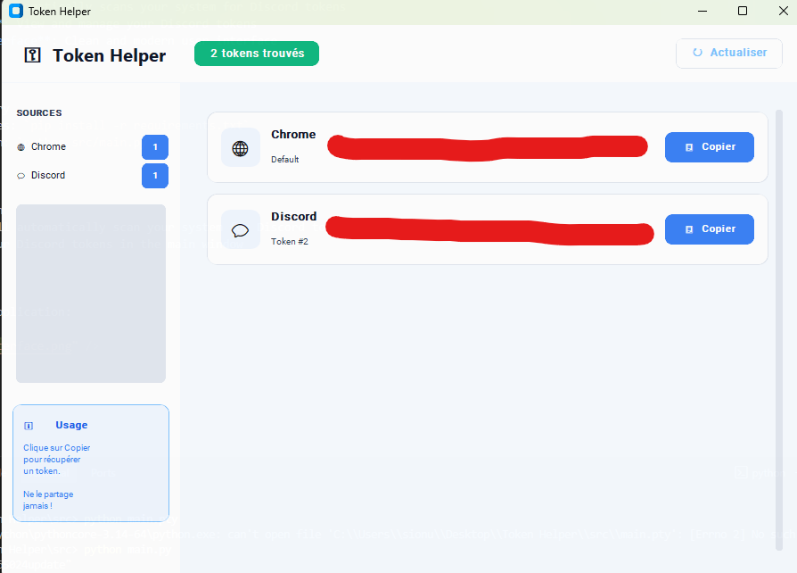

# Token Helper

Token Helper is a powerful tool for managing your Discord tokens. It allows you to scan your system for Discord tokens and provides a user-friendly interface to view and manage them.

## Features

- **Token Scanning**: Automatically scans your system for Discord tokens
- **Token Management**: View and manage your Discord tokens
- **User-Friendly Interface**: Clean and modern user interface

## Installation

1. Clone the repository
2. Install dependencies: `pip install -r requirements.txt`
3. Run the application: `python src/main.py`

## Usage

1. Run the application
2. The application will automatically scan your system for Discord tokens
3. View and manage your Discord tokens in the main window

## Interface

1. Interface of the application:

2. To know about the interface It was precisely made by ia gemini 4.6

3. To know about the backend made by xql.dev

---------------------------------------------------------------------------------------------

# for more information contact a8ke on discord

# t o k e n - h e l p e r
